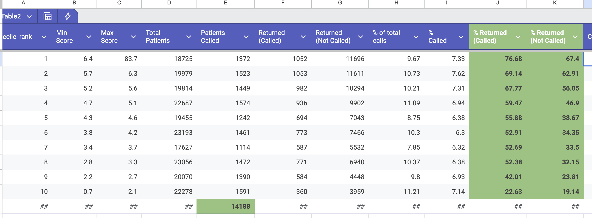

# Using Predictive AI to Prioritize Patient Care

**By the Simple Team** *March 12, 2026*

In the world of public health, we often talk about "limited resources" in terms of medicine, staff, or funding. But there is one resource that is arguably the most constrained: **the time of a healthcare worker.**

In clinics across the regions Simple serves, a nurse or community health worker may have a list of hundreds of patients who are overdue for their hypertension or diabetes follow-up. Between managing active consultations and clinical duties, that worker might only be able to contact 10% to 20% of these patients. When using a natural patient call order, they might spend this time reaching people who were already planning to come in, or which will not come back anyway.

We are changing that. By using **Predictive AI**, we are moving toward a model that limited time is spent calling the patients where the intervention will have the highest life-saving impact.

---
## Our Strategy: Intelligence at the Frontline

The core of our strategy is to transform raw clinical data into a prioritized action plan. This isn't about replacing the healthcare worker; it’s about giving them a "clinical GPS" to navigate their overdue list more effectively.

### 1. Feature Engineering: The Patient’s Digital Footprint
The first step is gathering and structuring data from the Simple ecosystem. We look at the longitudinal history of a patient, which provides much more signal than a single data point. Key features include:

* **Clinical Indicators:** We analyze Blood Pressure (BP) history and control status.
* **Visit Behavior:** We look at "Visit Adherence"—how many days usually pass between a scheduled appointment and the actual visit? We also factor in the total number of previous successful visits.
* **Demographics:** Age, gender ... 

### 2. Deep Dive: Training the Predictive Model
To turn this data into a prediction, we follow a rigorous machine learning pipeline. You can view the full implementation in our [public repository](https://github.com/simpledotorg/poc_scoring_partient_return).

#### The Training Architecture
We utilize a **Supervised Learning** approach. We compile a dataset consisting of all patient interactions and characteristics from the last 12 months. 

* **Data Partitioning:** To ensure the model is reliable and not just "memorizing" data (overfitting), we use an **80/20 split**. 
    * **80% Training Set:** The model studies this data to find correlations between patient history and return rates.
    * **20% Test Set:** This "hold-out" data is used to evaluate the model's accuracy on unseen patients.
* **Algorithm Selection:** We employ ensemble methods like **XGBoost** or **Random Forest**. These models are excellent at handling tabular clinical data and capturing non-linear relationships. TODO: rewrite this

#### What exactly are we predicting?
The model doesn't just give a single "score." We train it to calculate **three distinct indicators** that help us understand the patient's likely behavior:
1. **Propensity to miss the next visit:** Identifying patients at high risk of becoming overdue before it even happens.
2. **Propensity to come back "naturally":** Identifying patients who may be late but typically return on their own without intervention.
3. **Propensity to come back if called:** This is the "sweet spot" for efficiency—identifying patients who are currently overdue but are highly likely to return specifically because of a phone call nudge.

### 3. Scoring and the "Ranked" Line List
Once the model is validated, we run it against the entire active database. Every overdue patient receives a **probability score** based on these indicators. 

Finally, we re-order the "Overdue Patient Line List" in the Simple app. Instead of a static or chronological list, the healthcare worker sees the patients at the top who have a high clinical risk and a high **propensity to come back if called**.

---
## 3. The Cost of Inefficiency

When outreach is not prioritized, the "cost" is measured in wasted clinical hours and missed opportunities for intervention. Our data reveals two major areas of inefficiency in traditional, unranked calling lists:

* **The "Unreachable" Group:** Healthcare workers often spend significant time calling patients in the lowest deciles who have an extremely low probability of returning regardless of the nudge. For instance, patients in the bottom 10% (Decile 10) show an actual return rate of only **19%** even when called—and in some datasets, as low as **0%**.
* 
* **The "Highly Motivated" Group:** Conversely, calling patients in the top deciles yields only marginal gains. Patients in Decile 1 already have a **67.4%** "natural" return rate without a call; reaching out to them only bumps that to **76.68%**, a mere **9.28 percentage point** improvement.

**The Strategy:** By identifying these "naturally returning" and "unlikely to return" groups, we can redirect nurse efforts toward the "persuadable" middle deciles, where a single phone call can most drastically shift the odds in favor of the patient’s health.

---

## The Human Impact
By optimizing the "call list," we reduce worker fatigue and increase clinical efficiency. More importantly, we ensure that we bring as many "lost to follow-up" patients back into the safety of the clinical system.

Predictive AI in Simple isn't about "big data" for the sake of it; it's about making sure that every minute a nurse spends on the phone is a minute that saves a life.

> **Want to see the code?** Explore our open-source [scoring logic on GitHub](https://github.com/simpledotorg/poc_scoring_partient_return) and join us in building the future of cardiovascular care.
